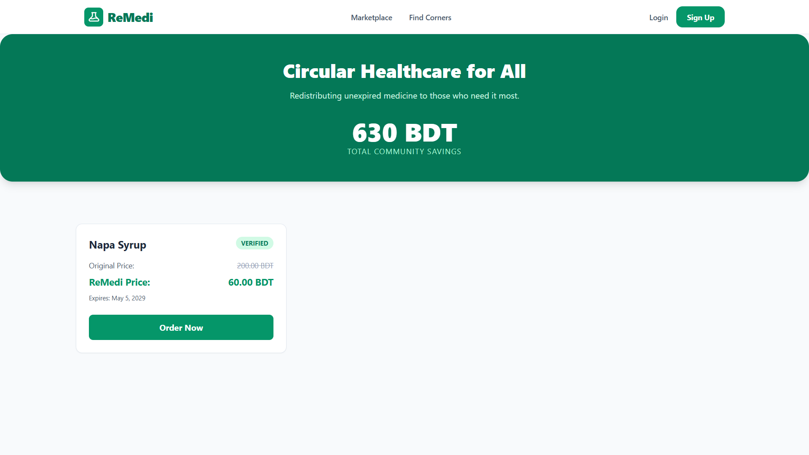
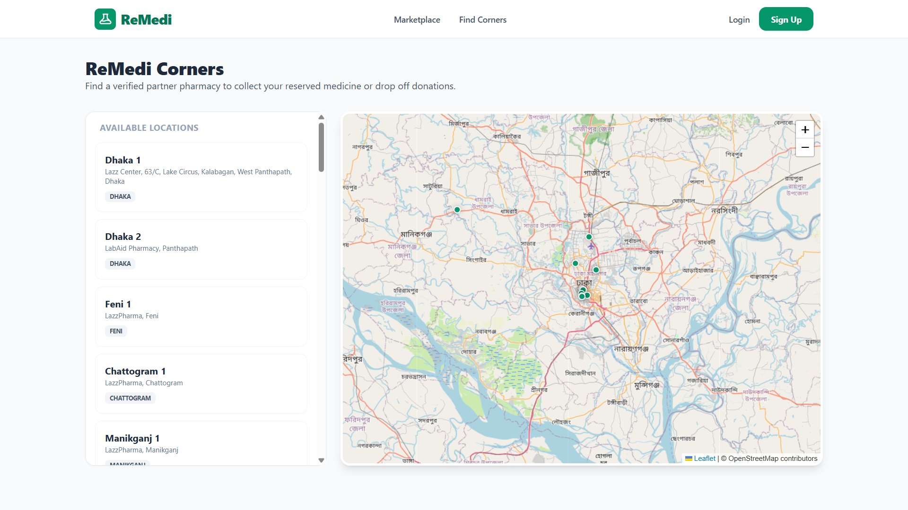
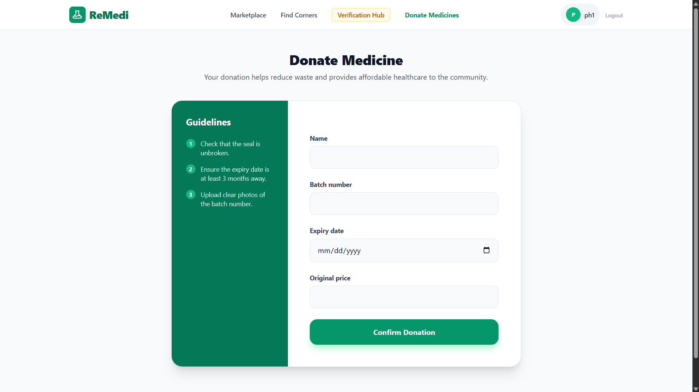
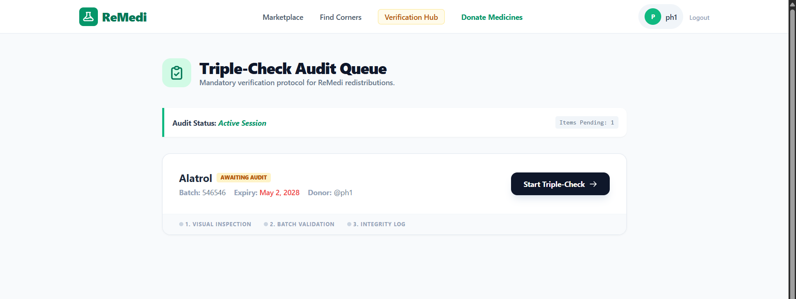

# 💊 ReMedi — Circular Healthcare Platform

A socially impactful web platform that enables the **safe redistribution of surplus medications** from donors to patients in need — reducing medical waste and improving healthcare accessibility. Built with Django, PostgreSQL, and Leaflet.js.

💻 **GitHub:** [github.com/jjannat04/ReMedi](https://github.com/jjannat04/ReMedi)

---

## 📸 Preview

> 
> 
> 
> 

---

## 🧩 Tech Stack

| Layer | Technology |
|-------|-----------|
| Backend | Python 3, Django |
| Frontend | Tailwind CSS, JavaScript |
| Database | PostgreSQL / SQLite |
| Maps | Leaflet.js |
| Auth | Django Built-in Auth + RBAC |
| Deployment | — |

---

## ✨ Features

- 💉 **Medicine Redistribution Pipeline** — Dual-interface platform for **Donors** (submit medicines) and **Patients** (request medicines), streamlining the full donation-to-collection workflow
- 🔬 **Triple-Audit Pharmacist Dashboard** — Custom status-transition logic ensures every donated medication is reviewed and approved by a verified Pharmacist before it becomes available in the marketplace
- 🗺️ **Location-Based Services** — Integrated Leaflet.js map APIs to help users find the nearest **ReMedi Corners** for physical medicine drop-offs and collections
- 🔐 **Role-Based Access Control (RBAC)** — Distinct permission scopes for **Admins**, verified **Pharmacists**, and general **Users**, ensuring platform integrity and data security
- 📱 **Responsive Frontend** — Tailwind CSS UI with clinical aesthetics, high readability, and optimised performance for low-bandwidth environments

---

## 📦 Dependencies

```txt
Django>=4.2
Pillow
psycopg2-binary
gunicorn
whitenoise
python-decouple
```

> Full list in [`requirements.txt`](./requirements.txt)

---

## 🚀 Run Locally

### 1. Clone the Repository

```bash
git clone https://github.com/jjannat04/ReMedi.git
cd ReMedi
```

### 2. Create & Activate Virtual Environment

```bash
# Windows
python -m venv venv
venv\Scripts\activate

# macOS / Linux
python3 -m venv venv
source venv/bin/activate
```

### 3. Install Dependencies

```bash
pip install -r requirements.txt
```

### 4. Configure Environment Variables

Create a `.env` file in the root:

```env
SECRET_KEY=your-django-secret-key
DEBUG=True
DATABASE_URL=sqlite:///db.sqlite3
ALLOWED_HOSTS=localhost,127.0.0.1
```

### 5. Apply Migrations

```bash
python manage.py makemigrations
python manage.py migrate
```

### 6. Create a Superuser (Admin)

```bash
python manage.py createsuperuser
```

### 7. Run the Development Server

```bash
python manage.py runserver
```

Open your browser at 👉 `http://127.0.0.1:8000`
Admin panel at 👉 `http://127.0.0.1:8000/admin`

> **Note:** To enable map features, make sure Leaflet.js is loaded via CDN in the base template (no extra install needed).

---

## 👥 User Roles

| Role | Access |
|------|--------|
| **Admin** | Full platform control, user management, analytics |
| **Pharmacist** | Review and approve/reject donated medicines |
| **Donor** | Submit medicines for redistribution |
| **Patient** | Browse approved medicines and request them |

---

## 🔗 Relevant Links

| Resource | Link |
|----------|------|
| 💻 GitHub Repo | [github.com/jjannat04/ReMedi](https://github.com/jjannat04/ReMedi) |
| 👤 Developer | [linkedin.com/in/jannatul-ferdous-b504831b3](https://www.linkedin.com/in/jannatul-ferdous-b504831b3/) |

---

## 👩‍💻 Author

**Jannatul Ferdous**
CSE Undergraduate @ CUET | Django & React Developer

[](https://www.linkedin.com/in/jannatul-ferdous-b504831b3/)
[](https://github.com/jjannat04)
[](https://codeforces.com/profile/jjasperruby)

---

> ⭐ If you found this project useful, consider giving it a star!
